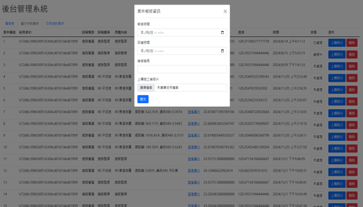

# Road-Maintenance-Reporting-System 道路養護通報系統
一個智慧型道路養護通報 LINE Bot，讓民眾輕鬆回報道路問題，協助政府提升道路品質監督效率
## 專案簡介
本專案是碩士論文《運用 LINE Bot 促進公民參與之道路養護通報系統設計》的實作成果，旨在開發一個創新的智慧型道路通報系統。

研究目標：
- 建立強化公民參與便利性與回報精確度之智慧型道路養護通報系統
- 提供民眾與政府部門雙向溝通的便民服務平台
- 透過 LINE Bot 即時回報道路狀況，降低通報門檻

核心理念：本系統設計強調操作的即時性與彈性，讓使用者無論於何時何地都能回報道路狀況及追蹤案件處理進度。透過簡易介面與分類管理機制，降低使用者通報門檻，並整合照片上傳、地理定位、分類管理與遊戲化設計等功能，提升民眾持續參與的動機。

解決的問題：
- 政府端面臨的挑戰：負責道路檢查和維護面臨人力不足的問題，加上傳統紙本作業耗時費力易造成資料遺漏與環保負擔
- 現有系統的不足：目前與道路考評相關的公民參與系統大多針對人行環境內容作回報，整體的道路品質評估仍顯不足，且無法自動整合地理資訊回報，便利性不足
- 資訊透明度與回饋機制問題：民眾須等到考評後才能關注到實際的考核與改善成果，易導致資訊透明度不足，降低民眾參與動機
## 使用技術
### 前端技術
- 程式語言：JavaScript
- 樣式設計：HTML、CSS
- LIFF（LINE Front-end Framework）
- 地圖服務：Mapbox GL
- 圖表視覺化：Chart.js
- 前端工具庫：jQuery
### 後端技術
- 運行環境：Node.js + Express
- LINE Bot SDK
- 影像辨識模組：Python - 整合第三方影像辨識模型（YOLOP）用於道路相片篩選
- 檔案上傳：Multer
- 圖片資訊處理：EXIF.js
### 資料庫與雲端服務
- 資料庫：Firebase
### 開發工具
- 打包工具：Webpack
## 主要功能
### 民眾端 - 道路回報
- 多層級下拉選單：根據道路考評手冊設計下拉選單，引導使用者精確回報道路問題
- 案件圖片處理
  - 自動擷取照片 EXIF 定位資訊記錄案件位置
  - 圖片預覽功能確保上傳正確性
  - 整合 YOLOP 影像辨識自動篩選不符合道路項目的圖片
- 精確定位系統：自動取得圖片定位或透過 Mapbox 地圖手動選點
- 平坦度檢測
  - 使用手機加速度計與 GPS 資料計算 ARI 值
  - 取代傳統 IRI 專業設備，實現量化道路平坦度檢測
  - 異常數值自動記錄與定位
- 考評標準輔助：提供各評分項目範例圖片，協助民眾依照實際考評準則回報
- 遊戲化集點機制：成功回報獲得點數，透過 LINE Bot 即時通知累積進度
### 民眾端 - 道路案件進度查詢
- 案件進度查詢
  - 查看所有民眾回報案件的詳細資訊
  - 顯示處理狀態、案件類別、內容描述與照片
  - 記錄案件位置與回報時間
- 社群互動機制
  - 案件按讚與評論功能
  - 對他人評論進行按讚互動
  - 促進民眾參與討論與意見交流
- 地圖視覺化瀏覽
  - 地圖模式查看案件分布位置
  - 快速了解周遭道路狀況
  - 地理資料視覺化
### 民眾端 - 道路案件成果查詢
- 案件成果查詢
  - 專門瀏覽政府部門「已處理」的案件
  - 瀏覽案件處理後的成果照片
  - 顯示政府部門處理案件時間
  - 提供處理成果的社群評價機制
### 民眾端 - LINE Bot 自身回報的道路案件進度 & 集點查詢
- 個人化機制
  - 透過 LINE Bot 查詢個人回報的道路案件
  - 透過 LINE Bot 查詢個人累積點數
  - 預留點數應用擴充性（獎勵兌換等）
### 政府端 - 後台管理系統
- 民眾回報的道路案件資訊查詢
  - 表格式案件管理
  - 案件狀態更新（待處理 → 處理中 → 已完成）
  - 處理進度照片上傳與說明
  - 完工資料填寫（報修時間、修復時間、維修廠商、成果照片）
- 數據儀表板
  - 各案件類別點讚數統計與趨勢分析
  - 網頁瀏覽人數與使用者數據追蹤
  - 關注度指標作為案件處理優先順序參考
  - 預留擴充功能（圖表分析內容）
## 系統展示
### 民眾端功能

  
  
<em>從選擇回報項目到完成通報的完整操作</em>

**關鍵技術特色：**
- **智能表單設計** → 多層級下拉選單引導精確分類
- **自動定位功能** → 擷取照片 EXIF 資訊，無資訊時顯示 Mapbox 地圖供手動選點
- **AI 品質把關** → 利用 YOLOP 篩選照片，不符合標準時提示重新上傳
- **即時回饋** → 回報成功即可集點

  
  
<em>回報平坦度項目的完整操作</em>

**關鍵技術特色：**
- **民用化檢測** → 將需要專業 IRI 檢測車的道路平坦度評估，轉化為手機即可操作的便民工具
- **感測器數據融合** → 即時分析手機三軸加速度計數據，結合 GPS 軌跡計算 ARI 指標
- **智慧化數據處理** → 自動識別異常震動數值，精確記錄問題路段的地理座標
- **零學習門檻** → 民眾無需專業知識，簡單操作即可完成量化的道路品質評估

  
  
<em>案件進度查詢頁面</em>

  
  
<em>案件進度查詢頁面之社群互動</em>

  
  
<em>案件成果查詢頁面</em>

  
  
<em>LINE Bot自身回報的道路案件進度查詢</em>

  
  
<em>LINE Bot集點查詢</em>

### 政府端功能

  
  
<em>民眾回報的道路案件資訊列表</em>

  
  
<em>民眾回報的道路案件狀態更改</em>

  
  
<em>道路修繕照片上傳</em>

  
  
<em>填寫已完成案件相關修繕資訊</em>

  
  
<em>已完成案件資訊列表</em>

  
  
<em>儀表板</em>

## 第三方資源與致謝
### 影像辨識模組
本專案的道路案件照片篩選功能基於以下開源模型進行客製化開發：
**YOLOP (You Only Look Once for Panoptic Driving Perception)**
- **模型來源**：[hpc203/YOLOP-opencv-dnn](https://github.com/hpc203/YOLOP-opencv-dnn) - OpenCV 部署版本
- **原始研究**：[hustvl/YOLOP](https://github.com/hustvl/YOLOP) - 華中科技大學視覺團隊
- **模型類型**：多任務網路，可處理目標檢測、可駕駛區域分割、車道檢測
- **授權條款**：MIT License
- **論文引用**：Wu, Dong, et al. "YOLOP: You Only Look Once for Panoptic Driving Perception." arXiv preprint arXiv:2108.11250 (2021).
- **客製化應用**：基於原始模型架構，針對道路問題識別需求進行調整
- **訓練資料集**：BDD100K 自動駕駛資料集

### 道路平坦度檢測
本專案的手機 ARI 值計算功能參考以下學術研究：
**ARI (Acceleration RMS Index)**
- **研究來源**：「智慧型手機於鋪面平坦度篩選檢測之應用」碩士論文，國立臺灣大學土木工程學研究所 (2016)
- **實作應用**：根據論文提出的 ARI 計算方法，整合手機加速度計與 GPS 資料進行即時道路平坦度檢測
